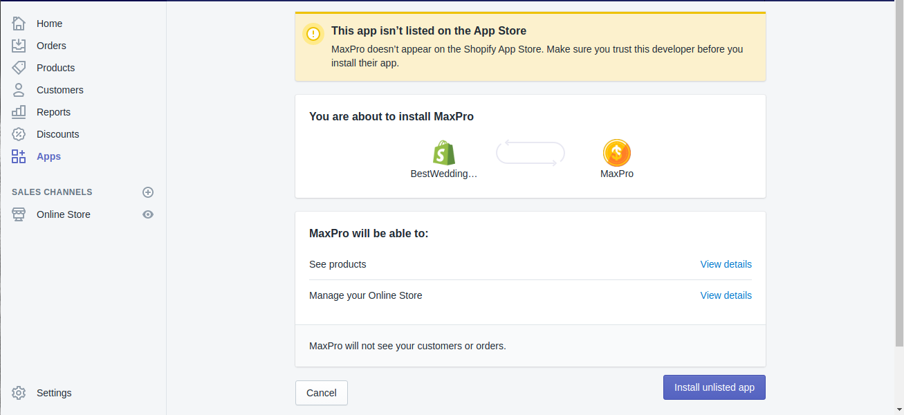
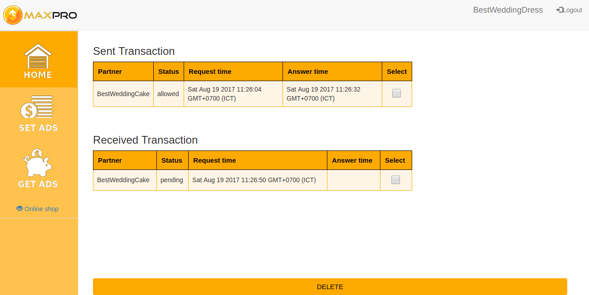
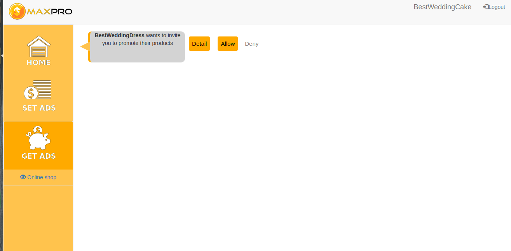
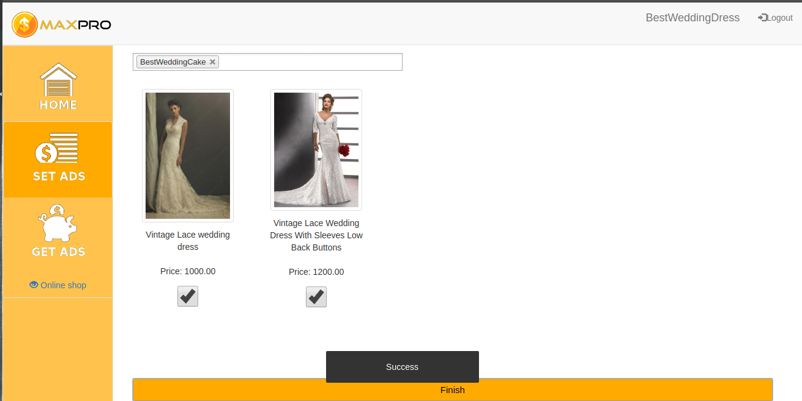
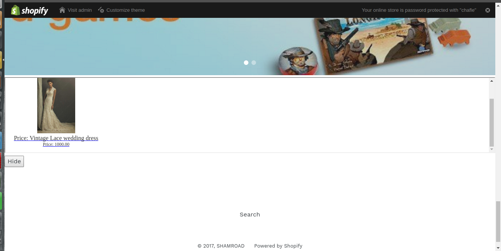
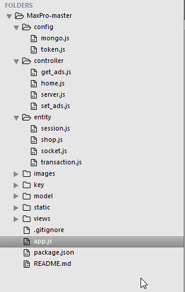

***MaxPro - Team Intern GCALLS 2016***
======================================

MAXPRO - Maximize your profit not by competition but by cooporation
## Geting Started

### Installation
&nbsp;Git clone or download project as zip and use SublimeText in Ubuntu to build and run
## Features
* Easy set up and sign in throught Shopify, not need to have an private account.<br />
  
* Seamless intergration of Maxpro with your store and your partners.<br />
  
* Link your store with your partners to expand market.<br />
  
* Increase your sales upon promoting your products better.<br />
  
* Increased accessibility to customers<br />
  
* Get more passive profit without effort<br />
  


## Project folder
<br />


## Build with
* Express Framework Nodejs (https://expressjs.com/)
* IOSocket (https://socket.io/)
* shopify-node-api (https://www.npmjs.com/package/shopify-node-api
* shopify-api-node (https://www.npmjs.com/package/shopify-api-node)
* MongoDBConnector (https://www.npmjs.com/package/connect-mongodb-session)
* ...

## Server

### Install dependencies

*Prerequisite*
 - a working database connection MongoDB
 - nodejs, npm, git

**Step 1 Install `source` which will also include the web app**

	$ git clone https://github.com/kimvu3010/MaxPro.git

**Step 2 cd into the web app directory**

	$ cd <SavePath>/MaxPro-master

**Step 3 install dependencies**

	$ npm install

**Step 4 edit `config/mongo.js` by setting database and database_conn to your **values

**Step 5 run the app**

	node app.js

*If you see something like this*

	$ Server is running on port 3000.


Then everything is okay, change your app setting and install it to your store to use.
If you experience anything different, redo the steps and make sure you did them in order and with no errors.

```shell
MaxPro-master
├── config
│   └── mongo.js
│   └── token.js
├── controller
│   └── server.js
├── entity
│   ├── session.js
│   ├── shop.js
│   ├── socket.js
│   └── transaction.js
├── key
│   ├── cert.pem
│   ├── key.pem
│   └── passphrase.js
├── model
│   └── database.js
├── static
│   ├── assets
│   │ ├── 0.png
│   │ ├── 1.png
│   │ ├── 2.png
│   │ ├── logo.png
│   │ └── main-icon.pngn
│   └── css
│     └── appStyle.css
├── views
│   ├── escape_iframe.ejs
│   ├── firstq.ejs 
│   ├── get_ads.ejs
│   ├── layout.ejs
│   ├── main.ejs
│   ├── maxproscript.ejs
│   ├── menu.ejs
│   └── set_ads.ejs
└── app.js

9 directories, 26 files
```

## Certifications
- Add your keyfile  
    `$ cd <SavePath>/MaxPro-master/key/key.pem`
    `$ cd <SavePath>/MaxPro-master/key/cert.pem`
- Add your passphrase 
    `$ cd <SavePath>/MaxPro-master/key/passphrase.js`
- Add your shopify key
    `$ cd <SavePath>/MaxPro-master/config/token.js`

    `module.exports = {`
    `API_KEY: <Your_API_key>,`
    `API_SECRET: <Your_API_secret>`
`};`

## Shopify post script
*Shopify doesn't allow us to post script with http and local address, in my app I use ngrok to test. So you have to change those into your own https address. Search for "ngrok" in file server.js to change.*

## Authors
 &nbsp; Kim Vu <vu.kim.3010@gmail.com> - Interns at GCALLS Company<br />
 &nbsp; Minh Thai <tnminh.vn@gmail.com> - Interns at GCALLS Company<br />
 &nbsp; Lien Nguyen <thuylien2301@gmail.com> - Interns at GCALLS Company
# License
&nbsp;This project is licensed under the MIT License

## Feedback

All feedback is welcome. Let me know if you have any suggestions, questions, or criticisms. 
